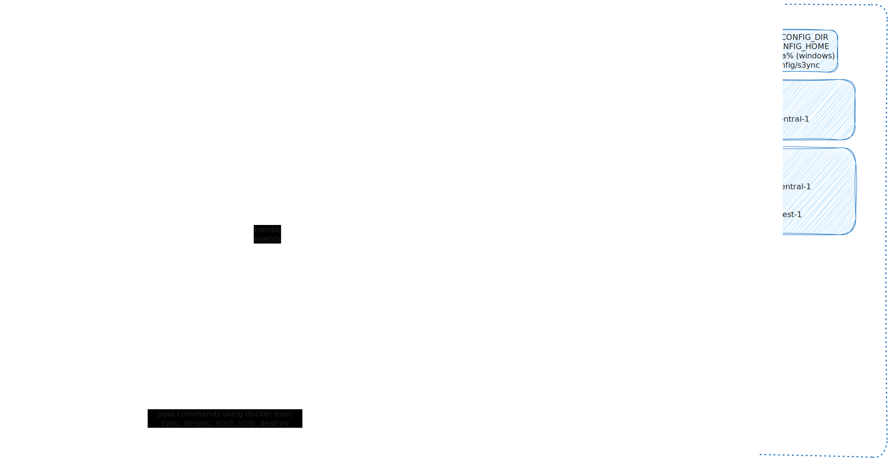

# s3ync

Automate the synchronization of your local backups or changes with S3 buckets.



## Commands

Initialize config file:
```
s3ync config init
```

List all profiles with details
```
s3ync config list
```

Get the newly added profile (user1) from ~/.aws/config and add it to the s3ync config file.
```
s3ync config add --profile user1
```

### TODOs

#### sync
    ● Add sync data to config file, syncs of the profile
    ● Add path to the watcher (fsnotify)
    ● Catch events and sync to bucket
    ● If recursive delete files if not just skip the event

#### unsync
    ● Delete path from watcher
    ● Delete sync data from config file as well
```
-l --local: local directory to listen on (exact arg)
-b --bucket: bucket to sync the local directory (exact arg)
-r --recursive: to sync delete events as well (optional)
-p --profile: profile of the bucket (exact arg, null: default(~/.aws/config))

s3ync sync -l /path/to/dir -b bucket-name --profile

s3ync unsync -l /path/to/dir -b bucket-name --profile

```

---

Get list of syncs details of the profiles
```
s3ync sync list --profile
```


The config file remains the same but kills the watcher to stop running in the background...
```
s3ync stop
```
Maybe: ```s3ync stop --profile user1```

Restart watcher to run in background again...
```
s3ync restart
```
Maybe: ```s3ync restart --profile user1```

Destroy everthing, config file, watcher... 
```
s3ync destroy
```
---

#### YAML
```
s3:
  profiles:
    default:
      region: eu-central-1
      syncs:
        "1":
          local: /path/to/dir
          bucket:
            region: eu-central-1
            name: bucket-name
    user1:
      region: eu-west-1
      syncs:
blob:
gcp:
```

### Future

Alternative Object Storage Services to sync with
- Azure Blob Storage
- Google Storage
